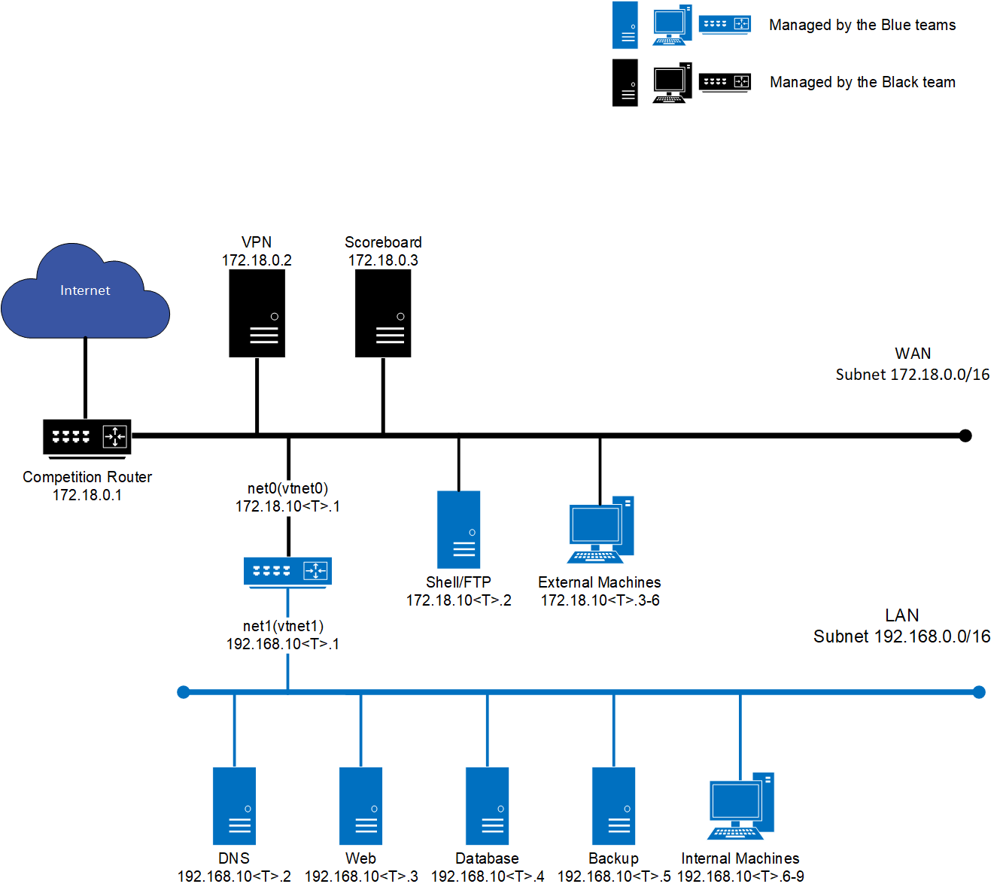

# NCAE Cyber Games Tryouts

## Introduction

Welcome to the NCAE CyberGames Tryouts. This will give you an introduction to what the competition is like and give you practice in setting up and securing your assigned network.

You will be assessed based on maintaining the availability, functionality, and security of services in your network and preparedness. There will be no red team, so this tryout focuses entirely on defense, debugging, and service availability.

## Instructions

To sum it up, you will get points when services are working as they should, and you won't get points when they are not working. 

During the tryouts, you will be working alone, but in the competition, you will be in teams of 10. There will be a scoreboard that will show the status of each service, which will update every minute. The scoreboard is located at [`172.18.0.3`](http://172.18.0.3/team-lab/1#) and is only accessible when you are connected to the VPN. 

You will not receive any help to debug your systems or set up any of your services. If you have a question about scoring, please talk to Sebastian or Macen.

## Rules

1. Throughout the tryouts, black team members may occasionally need access to a team's system(s) for scoring, troubleshooting, etc. Participants must immediately allow access when requested.
1. Participants are forbidden from collaborating with or communicating with other Participants in any way. All questions should be directed towards the Black Team.
1. Participants must complete the tryout without "outside assistance" from the start of the tryout to the end of the lab. All private communications (calls, emails, chat, texting, directed emails, forum postings, conversations, requests for assistance, etc.) with others that would help the Participants gain an unfair advantage are not allowed.
1. Participants are free to secure their systems, but no offensive activity against any system outside the Participants' assigned network(s), including those of other Participants, will be tolerated. Any Participant performing an offensive activity against any system outside the Participant's assigned network(s) will immediately fail the lab. If you have any questions or concerns during the tryout about whether specific actions can be considered offensive, please contact the Black Team before performing those actions.
1. Participants are allowed to use active response mechanisms such as TCP resets when responding to suspicious/malicious activity. Any active mechanisms that interfere with the functionality of the scoring engine or manual scoring checks are exclusively the responsibility of the Participants. Any firewall rule, IDS, IPS, or defensive action that interferes with the functionality of the scoring engine or manual scoring checks is exclusively the responsibility of the Blue Team.

### Internet Usage

1. Public internet resources such as FAQs, how-to's, existing forums and responses, and company websites are completely valid to be used for the tryout, provided there is no fee required to access those resources and access to those resources has not been granted based on a previous membership, purchase, or fee.
1. Only resources that could reasonably be available to all teams are permitted. For example, creating a personal public GitHub repository would be prohibited, as no other team would reasonably be able to access the repository.
1. All Internet resources used during the tryout must be freely available to all other teams.
1. If there are any questions or concerns during the tryout about whether or not specific materials are unauthorized, contact the Black Team immediately.
1. All network activity that takes place on the tryout network may be logged and subject to release. We are not responsible for the security of any information, including login credentials, that students place on the tryout network.

### Questions, Disputes, and Disclosures

1. Protests by any team must be presented in writing by the Participants as soon as possible. The Black Team will be the final arbitrators for any protests or questions arising before, during, or after the lab. Rulings by the Black Team are final.

### Scoring

1. Scoring will be based on keeping required services available and functional and controlling/preventing unauthorized access. Teams accumulate points by successfully maintaining services. 
1. Any team action that interrupts the scoring system is exclusively the responsibility of that team and will result in a lower score. Any Participants that modifies a system or system component, with or without intent, to mislead the scoring engine into assessing a system or service as operational, when in fact it is not, may be disqualified and/or the team assessed penalties. Should any question arise about scoring, the scoring engine, or how scoring functions, the Team Captain should immediately contact the Black Team to address the issue.
1. Scoring will occur every 60 seconds, and machine statuses will update every 10 to 30 seconds

### Scoreboard Key
- **Green arrows** indicate that everything is working as intended.
- **Orange Exclamation** indicates that something is partially working. 
- **Red down arrows** indicate that something is not working.

## Service Requirements

NOTE: Any instance of `<T>` represents your team number. For example, if you're on Team 1, `172.18.200.<T>` translates to `172.18.200.1`If your Team Number is greater than 9, make sure to take off the extra 0 to leave yourself a valid IP. For example, if you are team 13 and the IP is listed as `172.18.20\<T>.1`, then the IP would be `172.18.213.1` and not `172.18.2013.1` 

## Network Diagram

### Router 

The router should return an ICMP request on the external WAN IP of `172.18.10<T>.1`

### WWW

Note that all Web checks are scored through the router.

WWW will be regarded as functioning if a request can be made to your router and return the webpage with a `200` status code from your web server. The website files are located in  `/var/lib/etechacademy`.

### WWW Content

Note that all Web checks are scored through the router.

- Web Scoring User: `admin`
- Web Scoring Password: `admin123`

Service Requirements:

- Web Server stays up
- PostgreSQL connection stays available to the web server
- Web content is correct (no errors) and fully functional
- Scoring User is able to log in and use the site as expected

### SSH

To score points for SSH, all of the users in the table below must be able to access the server using their SSH key. You will be given the public keys that are needed for these users. The public key is located in the `blueteam` home directory on the `shell-ftp` machine.

#### Users

- camille_jenatzy
- gaston_chasseloup
- leon_serpollet
- william_vanderbilt
- henri_fournier
- maurice_augieres
- arthur_duray
- henry_ford
- louis_rigolly
- pierre_caters
- paul_baras
- victor_hemery
- fred_marriott
- lydston_hornsted
- kenelm_guinness
- rene_thomas
- ernest_eldridge
- malcolm_campbell
- ray_keech
- john_cobb
- dorothy_levitt
- paula_murphy
- betty_skelton
- rachel_kushner
- kitty_oneil
- jessi_combs
- andy_green

### DNS

DNS should be available internally at `192.168.20<T>.2`
DNS should be available externally at `172.18.20<T>.1`
DNS Forward lookups for the following domain names point to the corresponding IP.
DNS Reverse lookups for the following IP Addresses point to the corresponding domain name

#### Required Domains

|DNS Address |  IP |    Description |
| -- | ------- | ------ |
| ns1.team\<T>.cyberjousting.org | 172.18.20\<T>.1 | Public DNS Nameserver |
| www.team\<T>.cyberjousting.org | 172.18.20\<T>.1 | Public Web Nameserver |
| shell.team\<T>.cyberjousting.org | 172.18.20\<T>.2 | Public SSH server |
| files.team\<T>.cyberjousting.org | 172.18.20\<T>.2 | Public File Share |
| ns1.team\<T>.net | 192.168.20\<T>.2 | Internal Alias for DNS Server |
| www.team\<T>.net | 192.168.20\<T>.3 | Internal Alias for Web server |
| db.team\<T>.net  | 192.168.20\<T>.4 | Internal Alias for MySQL server |

The above addresses containing `.cyberjousting.org` should be publicly available and will be scored through the router and checked for both forward and reverse lookups.

The above addresses containing `.team\<T>.net` will be scored from inside the internal network and checked for both forward and reverse lookups.

### FTP

All FTP scoring users must be able to log in, read, and write files. The files must keep the same file hash to be considered correct. 

FTP Login - Users must be able to log in using their password.
FTP Write - Users must be able to write/upload files to the FTP server.
FTP Read - The user must be able to read/download files from the server with the correct content.

#### Users 

- camille_jenatzy
- gaston_chasseloup
- leon_serpollet
- william_vanderbilt
- henri_fournier
- maurice_augieres
- arthur_duray
- henry_ford
- louis_rigolly
- pierre_caters
- paul_baras
- victor_hemery
- fred_marriott
- lydston_hornsted
- kenelm_guinness
- rene_thomas
- ernest_eldridge
- malcolm_campbell
- ray_keech
- john_cobb
- dorothy_levitt
- paula_murphy
- betty_skelton
- rachel_kushner
- kitty_oneil
- jessi_combs
- andy_green

#### FTP Files

- file_1.txt
- file_2.txt
- file_3.txt
- file_4.txt
- file_5.txt
- file_6.txt
- file_7.txt
- file_8.txt
- file_9.txt
- file_10.txt

The files are already located in `/mnt/files`

### SQL Login

- The database is initialized from the web application.
- The data is synced to the QA department via an automated task that reads PostgreSQL directly.
- The QA Department occasionally writes data back to the database as well.

#### Service Requirements

- The PostgreSQL Scoring user is able to log into PostgreSQL
- The PostgreSQL Scoring user can Read data
- The PostgreSQL Scoring user can Write data

 
#### Scoring Details

The PostgreSQL services are scored from the internal team network, using the internal IP address of `192.168.20<T>.4`.

- PostgreSQL scoring user: `bill_kaplan`
- PostgreSQL scoring password: `b1ackjack!`
- PostgreSQL Scoring user can login, read, and write to the database `db`
- PostgreSQL Scoring user can log, read, and write to the table users